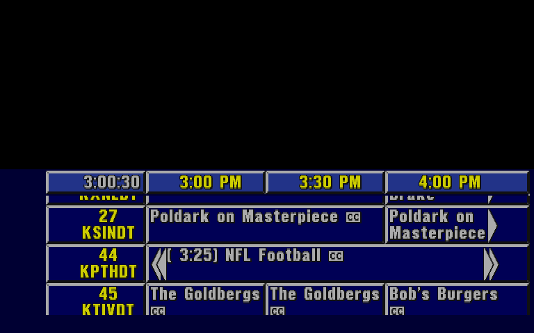

# AmigaSharp

AmigaSharp translates AmigaOS executables for the 68000 to C#, and runs them on a runtime that emulates the Amiga
libraries and a part of the chipset.



The picture shows Prevue Guide with the saved listings of November 1, 2020. The top half of the screen is black,
because the Prevue Channel showed a video in that area.

## Status

AmigaSharp is a hobby project. Its main target is Prevue Guide (ESQ), the Amiga program of the Prevue Channel. It also
runs the Amiga Test Kit, a program that takes over the machine and tests the hardware directly.

- It emulates the 68000 CPU only. It does not emulate the 68020 or later CPUs.
- It uses high-level emulation (HLE) of the Amiga libraries. It does not use a Kickstart ROM. C# code does the work
  of each library call.
- It emulates only the parts of the chipset that ESQ, the Amiga Test Kit and the samples use.

Other programs can use library calls or hardware that the runtime does not emulate.

## Requirements

- The .NET 10 SDK.
- vasm (`vasmm68k_mot`), only to rebuild the samples or to assemble the target program.
- ffmpeg on the PATH, only for `--stream`.

The launcher gets SDL2 from the Silk.NET.SDL package. You do not install SDL2.

## Windows

AmigaSharp runs on macOS, Linux and Windows. Each shell script in `scripts/` has a PowerShell version, with the same
name and the extension `.ps1`. The PowerShell scripts work in Windows PowerShell 5.1, which Windows 10 and 11 contain,
and in PowerShell 7. The examples in this document use the shell scripts. On Windows, use the PowerShell script with
the same name.

Windows does not run PowerShell scripts by default. Let PowerShell run the scripts on your computer, one time:

```powershell
Set-ExecutionPolicy -Scope CurrentUser RemoteSigned
```

The shell scripts get their settings from environment variables. The PowerShell scripts get them from parameters, and
they also read the same environment variables:

| Shell script | PowerShell script |
|---|---|
| `CHANNELS_DVR=<url> scripts/run-esq.sh` | `scripts\run-esq.ps1 -ChannelsDvr <url>` |
| `CHANNELS_DVR_INTERVAL`, `CHANNELS_DVR_PREMIUM` | `-Interval`, `-Premium` |
| `ESQ_DATE`, `ESQ_SCALE` | `-Date`, `-Scale` |
| `VASM`, `TARGET_SOURCE` of `build-target.sh` | `-Vasm`, `-TargetSource` |
| `EMBEDDED_PROGRAM`, `EMBEDDED_LISTING` of `publish.sh` | `-EmbeddedProgram`, `-EmbeddedListing` |

The other arguments of `run-esq.ps1` go to the launcher, as with `run-esq.sh`. For example, use
`scripts\run-esq.ps1 --scale 1`. Use `Get-Help scripts\run-esq.ps1 -Detailed` to see the parameters of a script.

- vasm has Windows programs on [its web site](http://sun.hasenbraten.de/vasm/). Put `vasmm68k_mot.exe` on the PATH,
  or give its path with `-Vasm`.
- Install ffmpeg with `winget install Gyan.FFmpeg`.
- Windows has no `nc`. To connect to the serial port, use another TCP client, for example `ncat` from Nmap.
- For `--stream`, Windows needs more steps. See [Stream the display as a TV channel](#stream-the-display-as-a-tv-channel).

## Files that the repository does not contain

This repository does not contain Prevue Guide or its data. The ESQ steps in this document need two directories that
are not public:

- `target-source/asm/` contains the assembly source of ESQ. `scripts/build-target.sh` assembles it to
  `build/target/ESQ` and its listing, and compares the result with a SHA-256 hash.
- `target-source/binaries/` contains a copy of the drive of a Prevue machine, with the fonts and the listing files.

Without these directories, the ESQ scripts stop with an error, and the tests of the target program skip. The samples,
the translator, the runtime and the other tests do not need them. If you have a copy of ESQ and its drive, give their
paths to the launcher or to `run-prevue.sh` (`run-prevue.ps1` on Windows).

This project is not related to the owners of Amiga, Prevue or Channels DVR, and they do not support it. These names
are trademarks of their owners.

## Projects

| Project | Purpose |
|---|---|
| `AmigaSharp.Runtime` | The 68000 CPU and its interpreter, the memory, the HLE libraries, and the chipset model. |
| `AmigaSharp.Translator` | Translates an executable and its vasm listing to a C# class. |
| `AmigaSharp.Host` | The launcher as a library: the options, the window, the stream, the genlock and the sound. |
| `AmigaSharp.Launcher` | Translates, compiles and runs any executable, and shows its display in a window. |
| `AmigaSharp.PrevueLauncher` | The launcher with the parts for Prevue: its control line, `/prevue/ctrl`, and its defaults. |
| `AmigaSharp.PrevueListings` | Writes Prevue listing files and a Prevue data feed from the guide of a Channels DVR server. |
| `AmigaSharp` | Runs the translated Hello World sample. |
| `AmigaSharp.Tests` | The tests. |

The folders of the repository:

```text
AmigaSharp.Runtime/          The emulated Amiga: CPU, memory, libraries, chipset. No code for one program.
AmigaSharp.Translator/       The translator from 68000 code to C#.
AmigaSharp.Host/             The launcher as a library, with its extension points (ILauncherExtension).
AmigaSharp.Launcher/         The generic launcher program: one file.
AmigaSharp.PrevueLauncher/   The launcher program for Prevue: the extension and the code for Prevue.
AmigaSharp.PrevueListings/   The listings tool for Prevue.
AmigaSharp.Tests/            The tests of all the projects.
docs/                        The documents: ctrl-line.md and orchestration.md are about Prevue.
scripts/                     The scripts to build and run. run-esq and scripts/dist/ are for Prevue.
```

The two launchers use `AmigaSharp.Host`. A launcher for a program is a small project that calls `Launcher.Run` with
an `ILauncherExtension`. The extension adds the options, the parts and the defaults of the program.
`AmigaSharp.PrevueLauncher` is the example. `AmigaSharp.Launcher` has no extension, and it runs any program as a plain
Amiga.

## Build

Run this command in the root of the repository:

```sh
dotnet build -c Release
```

You do not have to build first to use the examples in this document. `dotnet run` builds the project before it runs
it. To make native programs that do not need .NET, see
[Build programs for other people](#build-programs-for-other-people).

## Run a program

The launcher translates the program, compiles it, and keeps the result in a cache. The next start uses the cache.

```sh
dotnet run --project AmigaSharp.Launcher -c Release -- <executable> --listing <file.lst>
```

Use `--help` to see all the options. These options are the most important:

- `--drive <directory>` sets the host directory of `SYS:`.
- `--volume NAME=<directory>` and `--assign NAME=<path>` make the volumes and the assigns of the program.
- `--serial-port <port>` sets the TCP port of the serial port. Connect to it with `nc localhost <port>`.
- `--screenshot <file.png>` saves the display after `--seconds` and does not open a window.
- `--virtual-time` uses a virtual clock. Time moves at each safe point, and a wait ends at once. So a run is the same
  each time, and it is as fast as the host can run it.
- `--press <seconds>=<key>` presses a key at a time, for example `--press 8=escape`.
- `--fast-cpu` runs the 68000 as fast as the host can. By default, the CPU runs at the speed of a real 68000
  (7.16 MHz) with a real-time clock. It sleeps when it is ahead, so a program that polls in a loop does not use a full
  host core.
- `--turbo <seconds>` and `--turbo-until <label>` run the 68000 as fast as the host can at the start, and then at
  its real speed. `--turbo-until` ends the turbo when the word at a label of the listing is not 0. The script uses
  `--turbo-until _ESQ_MainLoopUiTickEnabledFlag`, so ESQ starts as fast as with `--fast-cpu`.
- `--watch <label>` writes each change of the word at a label of the listing, for example
  `--watch _Global_RefreshTickCounter`.
- `--stats` writes the speed each second: the frames made and dropped, the time to make a frame, the time that the
  program waited, and the rate of the VERTB and AUD1 interrupts.
- `--date <date>` sets the date and the time of the Amiga at the start, for example `--date 2020-11-01T16:00`.
  Prevue shows saved listing data only on the date of that data.

In the window, the keys of the host go to the Amiga keyboard. F11 is the Help key.

This command runs Prevue with a copy of the drive of the original machine. Prevue writes to its drive, so do not use
`target-source/binaries` directly:

```sh
cp -R target-source/binaries /tmp/prevue-drive
dotnet run --project AmigaSharp.PrevueLauncher -c Release -- build/target/ESQ --listing build/target/ESQ.lst \
    --drive /tmp/prevue-drive
```

The launcher for Prevue sets the defaults of a Prevue machine. The drive is also DH1:, and DF0: and ENV: are DH1:.
The command name is esq, and the arguments are the selection code GA24005. Use `--help` to see all the defaults.

Run `scripts/build-target.sh` first to make `build/target/ESQ` and its listing. `scripts/run-esq.sh` does all of
these steps.

## Show the saved listings

The quickest way is the script. It opens Prevue in a window, with the saved 2020 listings:

```sh
scripts/run-esq.sh
```

The first run copies the drive to `build/drive/` and unpacks the listing files there. Delete `build/drive/` to start
again from the original drive. The script sends its arguments to the launcher, for example `--scale 1`.

To do the same steps by hand, follow the procedure below.

The listing files of the drive (`curday.dat` and `nxtday.dat`) are packed with PowerPacker, and Prevue cannot read
packed files. Unpack them in a copy of the drive, and run Prevue on the date of the data:

```sh
cp -R target-source/binaries /tmp/prevue-drive
dotnet run --project AmigaSharp.Launcher -c Release -- unpack /tmp/prevue-drive/curday.dat \
    /tmp/prevue-drive/nxtday.dat /tmp/prevue-drive/PWI? --output /tmp/prevue-drive
dotnet run --project AmigaSharp.PrevueLauncher -c Release -- build/target/ESQ --listing build/target/ESQ.lst \
    --drive /tmp/prevue-drive --date 2020-11-01T16:00
```

## Show the listings of a Channels DVR server

`AmigaSharp.PrevueListings` reads the guide of a Channels DVR server and writes the Prevue listing files
`curday.dat` and `nxtday.dat`. The files have the HD channels of the guide, in the order of their numbers. ESQ keeps
a maximum of 200 channels. Set `CHANNELS_DVR` to use it with the script:

```sh
CHANNELS_DVR=http://channels-dvr.local:8089 scripts/run-esq.sh
```

On Windows, give the address as a parameter:

```powershell
scripts\run-esq.ps1 -ChannelsDvr http://channels-dvr.local:8089
```

The script then writes new listing files to a separate drive copy, `build/drive-channels-dvr/`, before each run,
and the Amiga uses the time of the host. While ESQ runs, the tool reads the guide again every 10 minutes
(`CHANNELS_DVR_INTERVAL`). It sends the changes to the serial port as a Prevue data feed, so the grid stays current.
The feed has the same commands as the satellite feed of Prevue: `C` for the channel lineup and `P` for each program.
A day that ESQ does not have yet, for example the next day after the change at 5:00 AM, gets all its programs. The
launcher receives the feed at 4 times 2400 baud (`--serial-speed 4`). ESQ has no flow control, and it parses about
6 times 2400 baud, so a larger factor can fill its receive buffer.

To show premium channels on a red background, set `CHANNELS_DVR_PREMIUM` to their channel numbers or call signs,
with commas between them. For example, use `CHANNELS_DVR_PREMIUM=222,HBOHD`. The tool itself uses
`--premium <list>`. The text of a movie has the title in quotation marks, the year, the summary, and the rating.

To write the files to another drive, run the tool directly:

```sh
dotnet run --project AmigaSharp.PrevueListings -- --server http://channels-dvr.local:8089 --output <drive directory>
```

Use `--insecure` for an HTTPS address with a certificate that does not match the server. Use `--feed <file>` to
also write all the listings as a feed, for `--serial-file` of the launcher.

The files use the time zone `6` in their configuration. ESQ adds (time zone - 6) hours to the times of the listings
and of the clock, so with `6`, the grid and the clock show the local time of the host. The saved 2020 files use `5`,
and that is why their clock is one hour behind.

## Stream the display as a TV channel

The launcher can stream the display as live HLS video. ffmpeg (from the PATH) encodes it to H.264 at 29.97 pictures
each second, with an AAC audio track. An HTTP server gives the stream and an M3U playlist of one channel:

```sh
CHANNELS_DVR=http://channels-dvr.local:8089 scripts/run-esq.sh --headless --stream 8091 --deinterlace blend \
    --stream-name "Prevue Guide"
```

- `http://<this host>:8091/stream.m3u8` is the stream.
- `http://<this host>:8091/channels.m3u` is a playlist for a custom channel in Channels DVR. Add it as a custom
  channel source of the type M3U playlist, with the address of this host that the server can reach.
- The picture is 4:3 in a 1280 by 720 picture with black bars at the sides. `--stream-4x3` makes a 960 by 720
  picture without bars.
- The sound of the stream is the sound of the Amiga, with the sound of the genlock video and with music. For Prevue,
  the sound of the Amiga is silent.
- `--stream-audio <path>` puts music in the music queue of the stream: an M3U playlist, a text file with one audio
  file on each line, or a directory of audio files. The launcher reads the playlist when it starts. The files play
  in a loop, in the order of the playlist (or of their names in a directory). A path in a playlist can be relative
  to the directory of the playlist. A file that does not play leaves the loop. By default, the music plays while no
  genlock video with sound plays. When a video with sound starts, the music fades out in half a second and stops.
  When the video ends, the music fades in and continues from the same place. See
  [Control the sound](#control-the-sound).
- `--headless` runs without a window until Ctrl-C. The stream also works with a window.
- macOS can ask if the launcher can accept incoming network connections. Accept it, so that the server can connect.
- On Windows, only an administrator can listen for HTTP on all the addresses of the computer, so `--stream` stops
  with "Access is denied". Reserve the port for your account, and let the firewall accept connections to it. Do these
  steps one time, in a PowerShell window that runs as administrator. The example is for port 8091:

  ```powershell
  netsh http add urlacl url=http://*:8091/ user=$env:USERDOMAIN\$env:USERNAME
  netsh advfirewall firewall add rule name="AmigaSharp stream" dir=in action=allow protocol=TCP localport=8091
  ```

The Prevue channel showed its grid over a video: a genlock put the video in each pixel of color 0. `--genlock <file
or URL>` does the same in the stream. A file plays in a loop, and a URL plays live, for example a channel of an
HDHomeRun tuner (`http://<tuner>:5004/auto/v<channel>`):

```sh
CHANNELS_DVR=http://channels-dvr.local:8089 scripts/run-esq.sh --headless --stream 8091 --deinterlace blend \
    --genlock http://hdhomerun.local:5004/auto/v2
```

- The video fills the 4:3 picture, and its sides are cut. An interlaced video is deinterlaced. The video has the
  resolution of the display, about the resolution of NTSC.
- The top half of the screen, and the border at the sides of the grid, show the video. The grid does not use color 0.
- The stream shows each picture of the video once, with the picture of the display of the same moment. So the video
  and the grid both move at an even rate.
- The stream has the sound of the video. The music of `--stream-audio` stops while a video with sound plays.
- If a live source stops, the stream shows the display over black and continues. The launcher starts the source again
  after 2 seconds.

#### Queue videos

The genlock has a queue of videos. The HTTP server of the stream changes the queue while the stream runs. With
`--genlock-control` in place of `--genlock`, the stream starts with an empty queue. With no video in the queue, the
display shows over black.

Each video is a file or a URL, with these values in JSON:

| Value | Meaning |
|---|---|
| `source` | A file, a URL, or `black`. This value is necessary. A source with no video, for example a music file, plays over black. `black` is black and silence, for a pause. |
| `seconds` | The time that the video plays. Without it, a file plays to its end, and a URL plays until you skip it. `black` needs it. |
| `loop` | `true` to play a file in a loop. |
| `next` | `true` to put the video first in the queue, not last. |

For example, play a channel for 5 minutes, then a file to its end, then the channel for 10 minutes, then a song over
black:

```sh
curl -X POST http://localhost:8091/genlock/queue -d '[
  {"source": "http://hdhomerun.local:5004/auto/v2", "seconds": 300},
  {"source": "/videos/promo.mp4"},
  {"source": "http://hdhomerun.local:5004/auto/v2", "seconds": 600},
  {"source": "/music/theme.mp3"}
]'
```

These requests control the queue:

| Request | Result |
|---|---|
| `GET /genlock` | Gives the current video and the queue, as JSON. |
| `POST /genlock/queue` | Adds a video, or an array of videos, at the end of the queue. |
| `POST /genlock/next` | Ends the current video. The next video starts, or black shows. |
| `DELETE /genlock/queue` | Removes all the videos from the queue. The current video continues. |
| `DELETE /genlock/queue/<id>` | Removes one video from the queue. `GET /genlock` gives the ids. |
| `POST /genlock/stop` | Removes all the videos from the queue, and ends the current video. |

- A `POST` without data needs `-d ''` in curl, for example `curl -X POST -d '' http://localhost:8091/genlock/next`.
  Without it, the server gives the error 411 (Length Required).
- The time of a video is the time of the stream from its start, also while a live source starts.
- The launcher starts the next video 5 seconds before the current video ends, so the next video starts without black.
  A live source without `seconds` has no known end, so the next video starts with black for a few seconds.
- A file in a request must be on the computer of the launcher.

`--genlock-playlist <file>` starts the stream with the videos of a JSON file, in place of `--genlock` or
`--genlock-control`. The file has the videos of the queue, and `"loop": "all"` to play them in a loop. A relative
file is relative to the directory of the JSON file. For example, play a video, then show the grid over black for 3
minutes, and then start again:

```json
{
  "loop": "all",
  "queue": [
    {"source": "prevue-1993.mp4"},
    {"source": "black", "seconds": 180}
  ]
}
```

The HTTP server then controls the queue, as with `--genlock-control`. The file can also be a JSON array of videos,
with no loop.

Anyone who can connect to the port of the stream can change the queue, and can play any video file that the launcher
can read. Use the stream only on a network that you trust.

#### Control the sound

The sound of the stream has three layers:

| Layer | Sound |
|---|---|
| `video` | The sound of the current genlock video. |
| `music` | The music queue. `--stream-audio` fills it when the stream starts. |
| `amiga` | The sound of the audio channels of the Amiga. |

The music queue has the same requests as the genlock queue, at `/music` in place of `/genlock`: `GET /music`,
`POST /music/queue`, `POST /music/next`, `POST /music/stop`, `DELETE /music/queue[/<id>]`. The music queue plays
only the sound of its files. `POST /music -d '{"loop": "all"}'` plays the queue in a loop: a file that ends goes to
the end of the queue again. `"off"` plays each file once. The same request at `/genlock` loops the genlock queue.

These requests control the mixer:

| Request | Result |
|---|---|
| `GET /mixer` | Gives the settings and the level of each layer, and the duck settings, as JSON. |
| `POST /mixer/<layer>` | Changes a layer: `{"volume": 0.5, "muted": false, "fade": 2}`. |
| `POST /mixer/duck` | Changes when and how the music becomes quieter: `{"when": "video-has-sound", "volume": 0.2, "fade": 0.5}`. |

- Each value of a request is optional. The other values do not change.
- `volume` is from 0 to 4 for a layer, and 1 is the normal level. A change goes to the new volume in `fade` seconds.
  `muted` makes the layer silent, also in `fade` seconds.
- The duck makes the music quieter while the genlock video has sound. `volume` is the part of its volume that the
  music keeps: 0 stops it, and it continues from the same place later. `"when": "never"` turns the duck off, for
  example when another program sets the volume of the music itself.
- `level` in `GET /mixer` is the peak level of the layer in the last second, from 0 (silent) to 1 (full scale). A
  program can use it to see that a layer is silent, for example a live channel that lost its sound.

For example, make the music quieter in 3 seconds, and let it play at a fifth of its volume under the videos:

```sh
curl -X POST http://localhost:8091/mixer/music -d '{"volume": 0.3, "fade": 3}'
curl -X POST http://localhost:8091/mixer/duck -d '{"volume": 0.2}'
```

`--deinterlace` sets how the window, the screenshots and the stream show the interlaced display of Prevue:

- `weave` shows the two fields on their rows, as a TV does. Moving content has comb lines. This is the default.
- `bob` shows the last field with each row twice. It has no comb lines, and half the vertical detail.
- `blend` shows the average of the two fields. It has no comb lines, and moving content is a little blurred. It is
  the best mode for a stream.

## Replay a serial feed

Prevue gets its listings on the serial port. The launcher can replay a captured feed from a file:

- `--serial-file <file>` replays the bytes of the file in place of the TCP bridge. The bytes go at the baud rate of
  SERPER. The replay starts when the program enables the RBF interrupt.
- `--serial-start <seconds>` delays the replay. Prevue empties its receive buffer while it starts, so use 8 or more.
- `--serial-log <file>` writes each byte in the two directions to the file, with the time of the Amiga clock.
- `--prevue-feed-trace <file>` writes the commands that the Prevue feed parser reads, and the changes of its counters.
  For example, a change of `_DATACErrs` shows a checksum error. This option needs `--listing`, and the launcher for
  Prevue.

Use `--virtual-time` with a replay. The run is then the same each time. Run the replay on a copy of the drive,
because Prevue writes the data that it receives to the drive:

```sh
dotnet run --project AmigaSharp.PrevueLauncher -c Release -- build/target/ESQ --listing build/target/ESQ.lst \
    --drive /tmp/prevue-drive --virtual-time \
    --serial-file feed.bin --serial-start 8 --serial-log serial.log --prevue-feed-trace feed.log
```

## Send control commands

Prevue has a second input, a 110 baud control line. The Prevue channel used it to show promos of programs over the
genlock video. With `--stream`, the HTTP server sends commands on the line:

| Request | Result |
|---------|--------|
| `GET /prevue/ctrl` | Gives the bytes that wait for the line (`queued`), the seconds that the line needs to send them, and the bytes that the line sent. |
| `POST /prevue/ctrl/promo` | Shows a promo: `{"title": "Seinfeld", "channels": "*", "brush": "AT"}`. |
| `POST /prevue/ctrl/clear` | Removes the promo or the logo. The genlock video shows in the top half. |
| `POST /prevue/ctrl/logo` | Shows the current logo in the top half. |
| `POST /prevue/ctrl/packets` | Sends packets of the control line: `[{"type": 1, "body": "3"}]`. |
| `GET /prevue/state` | Gives what the top half shows, if Prevue read the commands, and the logos. |
| `GET /prevue/logos` | Gives the logos of `LOGO.LST`, the loaded logo, and the next line. |
| `POST /prevue/logos/next` | Chooses the logo that Prevue loads at the next logo command: `{"name": "Insider"}`. |

`--schedule <file>` plays a schedule: segments of videos and pauses, with the settings of the music and, for Prevue,
the top half of the screen. `GET /schedule` gives its state. See [Schedules](docs/orchestration.md#schedules).

For example, show a promo for Seinfeld from the saved listings, and then remove it:

```sh
curl -X POST http://localhost:8091/prevue/ctrl/promo -d '{"title": "Seinfeld", "brush": "AT"}'
curl -X POST -d '' http://localhost:8091/prevue/ctrl/clear
```

- Prevue finds the next time of the program in its listings. If it finds no program, it shows the current logo.
- The logos (for example "TV Guide sportsview") come from `LOGO.LST` on the drive. They cover all the top half, and
  ESQ changes them about each 3 minutes. An empty `LOGO.LST` stops them. See [Logos](docs/ctrl-line.md#logos).
- A promo can have a box on the right and a box on the left:
  `{"right": {"title": "Bob's Burgers"}, "left": {"title": "Seinfeld", "brush": "DT"}, "first": "left"}`. Prevue
  shows one box. It tries the box of `first` before the other box.
- The line sends 11 bytes each second, so a promo takes about 2 seconds. The requests wait in a queue. Prevue starts
  to read the line some seconds after the stream starts.
- `--prevue-ctrl-port <port>` opens a TCP port for the raw bytes of the line, and `--prevue-ctrl-file <file>` sends
  the bytes of a file. Do not send raw bytes and HTTP requests at the same time.
- These requests and options are in `AmigaSharp.PrevueLauncher`. The scripts for Prevue (`scripts/run-esq.sh` and
  `run-prevue.sh`) use it. `AmigaSharp.Launcher` has nothing of Prevue.

[docs/ctrl-line.md](docs/ctrl-line.md) gives the format of the packets and the known commands.
[docs/orchestration.md](docs/orchestration.md) tells how to use the videos, the music, the promos and the logos
together, with an example coordinator.

## Build programs for other people

`scripts/publish.sh` builds the launcher for Prevue (`AmigaSharp.PrevueLauncher`) and the listings tool as native
programs with Native AOT. The people who use them do not need .NET. The launcher for Prevue also runs other programs.
To publish only the generic launcher, use `dotnet publish AmigaSharp.Launcher -c Release -r <runtime identifier>
-p:PublishAot=true`.

```sh
scripts/publish.sh              # For this host, for example osx-arm64.
scripts/publish.sh osx-x64      # For a Mac with an Intel processor.
```

The programs go to `dist/<runtime identifier>/`, with `run-prevue.sh` and `README.txt` for the users. The script
copies the drive of a user to a data directory on the first run, unpacks the saved listings, and starts the launcher
with the options of the Prevue machine. It can also start the listings of Channels DVR and the stream:

```sh
./run-prevue.sh --drive /path/to/drive --channels-dvr http://channels-dvr.local:8089 --headless --stream 8091
```

Keep the files of the directory together. The launcher needs the SDL2 library next to it. Native AOT compiles only
for the operating system of the host, so build the Linux programs on Linux and the Windows programs on Windows.

On Windows, use `scripts\publish.ps1` (or `scripts\publish.ps1 -RuntimeIdentifier win-arm64`). Native AOT on Windows
needs the C++ build tools of Visual Studio: install the workload "Desktop development with C++" of Visual Studio or
of the Build Tools for Visual Studio. A Windows build has `run-prevue.ps1` and `run-prevue.cmd` in place of
`run-prevue.sh`. They have the same options. `run-prevue.cmd` starts the PowerShell script, so the users do not have
to change the execution policy:

```bat
run-prevue.cmd --drive C:\path\to\drive --channels-dvr http://channels-dvr.local:8089
```

A native launcher cannot compile a translation while it runs, so it uses the interpreter. The interpreter
runs about 17 million instructions each second, and a 68000 runs less than 1 million, so the speed of a program does
not change. A native build does not need the listing of the program. Without a listing, use `--turbo <seconds>` in
place of `--turbo-until`. The users need these files, which are not part of the programs:

- The program to run and its drive, for example `ESQ` and a copy of the drive of Prevue.
- ffmpeg on the PATH, for `--stream`.

The build can also translate one program and compile the translation into the launcher:

```sh
EMBEDDED_PROGRAM=build/target/ESQ EMBEDDED_LISTING=build/target/ESQ.lst scripts/publish.sh
```

The launcher then runs that program (found by its SHA-256) from the translation, and other programs in the
interpreter. The launcher is then 19 MB, not 7 MB. It contains the code of the program, so give it only to people
who can have that program. The speed of the emulated 68000 at full speed (`--fast-cpu`) for ESQ:

| Launcher | Speed |
|---|---|
| .NET, translation at run time | about 5,950 MHz |
| Native, translation at build time | about 4,350 MHz |
| .NET, interpreter | about 265 MHz |
| Native, interpreter | about 247 MHz |

A real 68000 runs at 7.16 MHz. At the real speed, all four use about a third of a host core, most of it for the
display and the pacing. The translation saves about 5% of a core.

macOS stops programs from the internet that Apple did not check. A user can remove the mark with
`xattr -dr com.apple.quarantine <directory>`, or the programs can be signed and notarized with an Apple developer
account.

## How it works

AmigaSharp does not emulate a full Amiga. It runs the code of the program, and C# code does the work of the
operating system.

### Translation

The translator reads the hunk executable and the vasm listing of the program. The listing tells which bytes are
instructions, and it gives the labels and the source lines. Without a listing, the translator follows the code from
the entry point. Each function of the program becomes a C# method, and each instruction becomes a block of C#. A
comment above each block shows the source line. This is a part of the translation of `samples/HelloWorld/hello.s`:

```csharp
// hello.s:14: JSR	OpenLibrary(A6)
// $20000A  JSR -552(A6)
{
    var target = cpu.A[6] - 552u;
    core.CallAddress(0x20000Eu, target);
}
// hello.s:15: TST.L	D0			;zero if OpenLibrary() failed
// $20000E  TST.L D0
{
    cpu.Cycles += 18;
    Ops.Logic(cpu, Size.Long, cpu.D[0]);
}
// hello.s:16: BEQ.S	NoDos			;if failed, skip to exit
// $200010  BEQ $200028
{
    if (cpu.Z) { NoDos(); return; }
}
```

The program loads at fixed addresses, so the translated code contains the addresses as constants. The launcher
compiles the C# code with Roslyn and keeps the assembly in a cache. The name of the cache file is a hash of the
executable, the listing and the translator.

### The interpreter

Some code has no translated method. For example, a program can copy code into memory, or the translator can miss a
function. The interpreter runs this code one instruction at a time. At each call, the runtime looks for a translated
method at the address. If there is no method, the interpreter runs the code. So translated code and interpreted code
can call each other.

The tests compare the translated code with the interpreter. The SingleStepTests 68000 test vectors check the
interpreter. A native launcher cannot compile C# code while it runs, so it uses only the interpreter.

### The libraries

The runtime has no Kickstart ROM. Each library is a C# class, and each library function is a method of that class.
The library base and its jump table are in the emulated memory, as on a real Amiga. Each vector is a `JMP` to a stub
address in the ROM area. When the code jumps to a stub, the runtime calls the C# method. So a program can read the
jump table or change a vector with `SetFunction`.

The runtime has these libraries, devices and resources:

- `exec.library`, `dos.library`, `graphics.library`, `intuition.library`, `diskfont.library` and `utility.library`.
- `serial.device`, `input.device`, `console.device` and `trackdisk.device`.
- `battclock.resource`.

Each library has only the functions that ESQ and the samples use. A call to another function stops the program. The
error message gives the name of the library and the offset of the function. `dos.library` maps the AmigaDOS volumes
and assigns to host directories.

### Tasks and interrupts

Each Amiga task runs on its own host thread, because the translated code of a task keeps its calls on the C# stack.
Only one task runs at a time. A task gives the CPU to another task when it waits, or at a safe point when its time
slice ends.

Translated code cannot stop at each instruction for an interrupt. So the runtime delivers the interrupts at safe
points: in each library call, in each wait, in the interpreter, and at each backward branch of translated code. A
loop that waits for an interrupt has a backward branch, so the loop can end.

### Timing

The runtime adds an estimate of the clock cycles of each instruction. It uses the estimate to run the CPU at the
speed of a 7.16 MHz 68000. When the CPU is ahead of the real time, the runtime sleeps. The estimate uses the main
rules of the 68000 timing tables, so it is near the real time, but not equal to it.

### The chipset

The runtime emulates the parts of an Amiga 2000 (ECS, NTSC) that ESQ and the Amiga Test Kit use:

- The display: the bitplanes, the copper, sprites, the display window, the scroll, dual playfield, extra half-brite
  and interlace. It makes each line when the beam passes it. It does not show HAM. The pixels of the genlock key
  (color 0, or the ECS key of BPLCON2) have alpha 0 in the picture.
- The blitter: area, fill and line blits. A blit ends at once.
- The interrupts of the custom chips and the CIAs. A program can use the handlers of exec, or write its own handlers
  to the exception vectors.
- The audio channels play their samples with DMA, with the low-pass filter of the power LED. The window and the
  stream play the sound, and `--audio-file <file.wav>` writes it to a file. Modulation and the play of AUDxDAT without DMA are not
  emulated.
- The serial port. A TCP port or a file on the host is the other end of the cable.
- The two CIAs: the ports, the timers, the time-of-day counters and the keyboard on the serial port of CIA-A.
- The mouse in port 1 and the joystick in port 2. In the window, the host mouse is the mouse, and a game controller
  of the host is the joystick.
- The battery-backed clock at $DC0000.
- The internal floppy drive DF0: the drive signals on the CIAs, the index pulse and the disk DMA. When the program
  runs from an ADF, the disk is in DF0 as AmigaDOS MFM tracks. A write changes only a copy in memory.

The addresses where an A2000 has nothing are an open bus: a write does nothing, and a read gives 0.

### Programs that take over the machine

The Amiga Test Kit is on an ADF disk image. Run it from the disk:

```sh
dotnet run --project AmigaSharp.Launcher -c Release -- AmigaTestKit.adf:AmigaTestKit --interpret
```

The program unpacks itself into memory when it starts, so the translator cannot see its code. Use `--interpret`.

## Tests

```sh
scripts/fetch-cpu-tests.sh   # The 68000 test vectors. The CPU tests skip without them.
scripts/build-target.sh      # The target program. The target tests skip without it.
dotnet test
```

On Windows:

```powershell
scripts\fetch-cpu-tests.ps1
scripts\build-target.ps1
dotnet test
```

## License

AmigaSharp uses the MIT license. See `LICENSE`.
