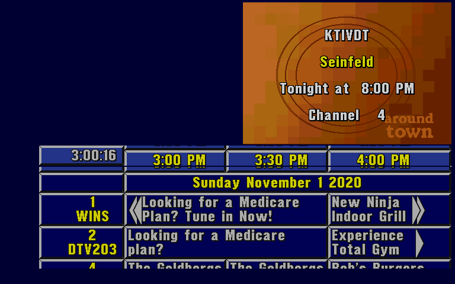
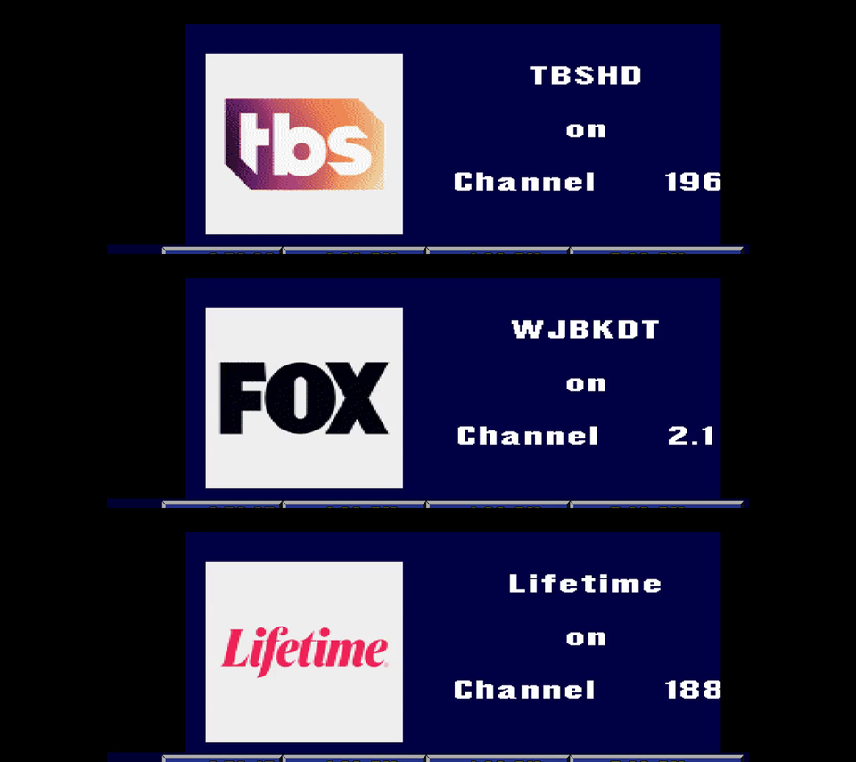

# The control line of Prevue

Prevue Guide has a second input, the control line (CTRL). The Prevue channel used it to show promos of programs in
the top half of the screen, over the genlock video. This document tells how to send commands on the control line
to AmigaSharp.

The CTRL format is not documented completely. The data in this document comes from the listing of ESQ, the
decompilation in [esq-decomp](https://github.com/rickz0rz/esq-decomp), and tests with the saved listings of the
drive. The [UVSG Satellite Data](https://prevueguide.com/wiki/UVSG_Satellite_Data) page and the
[Prevue forum](https://ariweinstein.com/prevue/viewtopic.php?t=140&start=20) have the first findings.

## The line

The control line is a 110 baud serial line on the CTS pin of the serial port. This pin is CIA-B port A bit 4.
Prevue samples the pin 1100 times each second in its AUD1 interrupt, and it decodes the bits itself. Each byte has a
start bit, 8 data bits (the lowest bit first), and a stop bit. One byte takes 91 ms, so the line sends 11 bytes each
second.

The launcher for Prevue (`AmigaSharp.PrevueLauncher`) has the control line. The scripts for Prevue use it. The
generic launcher (`AmigaSharp.Launcher`) does not have it. The launcher for Prevue has three sources for the line:

- With `--stream`, the HTTP server of the stream makes the packets. See [The HTTP server](#the-http-server).
- `--prevue-ctrl-port <port>` opens a TCP port on localhost. Each byte that a client sends goes on the line.
- `--prevue-ctrl-file <file>` sends the bytes of a file on the line.

Do not send HTTP requests and raw bytes at the same time. A packet of one source can then come in a packet of the
other source.

Prevue resets the line while it starts. So the launcher keeps the bytes until one second after Prevue starts to
sample the line. A client can connect and send at once.

The scripts of a distribution have the option `--prevue-ctrl-port` too:

```sh
./run-prevue.sh --drive /path/to/drive --prevue-ctrl-port 8092
```

## The HTTP server

With `--stream <port>`, these requests go to the port of the stream:

| Request | Result |
|---------|--------|
| `GET /prevue/ctrl` | Gives the bytes that wait for the line (`queued`), the seconds that the line needs to send them, and the bytes that the line sent (`sent`). |
| `POST /prevue/ctrl/promo` | Shows a promo. The body is JSON, see below. |
| `POST /prevue/ctrl/clear` | Removes the promo or the logo (type 1 with `3`). The genlock video shows in the top half. |
| `POST /prevue/ctrl/logo` | Shows the current logo in the top half (type 1 with `D`). |
| `POST /prevue/ctrl/packets` | Sends raw packets: `[{"type": 17, "body": "Seinfeld"}, {"type": 1, "body": "1*"}]`. In JSON, `\u0012` is the byte 0x12. |

The body of `/prevue/ctrl/promo` has a box on the right, a box on the left, or the two boxes:

```json
{
  "right": {"title": "Bob's Burgers", "channels": "*", "brush": "AT"},
  "left": {"title": "Seinfeld", "channels": "KTIV*", "brush": "DT"},
  "first": "left"
}
```

- `title` is the title to find. It is necessary for each box.
- `channels` is a pattern for the call letters of the channels. The default is `*`.
- `brush` is the ID of the background in `BRUSH.INI`. Without it, the box keeps its background.
- `first` is the box that Prevue tries first: `right` (the default) or `left`.
- `title`, `channels` and `brush` at the top of the object are for the right box: `{"title": "Seinfeld"}`.

The server makes the packets of [Show a promo](#show-a-promo) and adds them to a queue. The line sends 11 bytes each
second, so a promo takes about 2 seconds. To send commands in sequence, wait until `queued` in `GET /prevue/ctrl` is
0. Then wait some seconds more, because Prevue reads the packets when its display is not busy.

For example:

```sh
curl -X POST http://localhost:8091/prevue/ctrl/promo -d '{"title": "Seinfeld", "brush": "AT"}'
curl -X POST -d '' http://localhost:8091/prevue/ctrl/clear
```

## Packets

Each command is one packet:

```
<type> <body> <CR> <checksum>
```

- `<type>` is one byte from 1 to 22. It is not an ASCII digit.
- `<body>` is the text of the command. The maximum length of a packet is 198 bytes.
- `<CR>` is the byte 13 (0x0D).
- `<checksum>` is the XOR of all the bytes before it: the type, the body, and the CR.

Prevue ignores bytes that are not a type while it waits for a packet. Thus, a byte 0 is a pause of 91 ms. A packet
with a bad checksum does nothing.

This Python function makes a packet:

```python
def packet(type, body):
    data = bytes([type]) + body.encode("latin-1") + b"\r"
    checksum = 0
    for byte in data:
        checksum ^= byte
    return data + bytes([checksum])
```

## Show a promo

A promo is a box in the top half of the screen. It has the call letters, the title, the next time of the program, and
the channel number. Prevue has a box on the right and a box on the left. Prevue finds the program in its listings.

Send these commands:

1. Optional: type 2 selects the backgrounds of the boxes.
2. Type 17 sets the titles to find.
3. Type 1 with `1` shows the promo.

For example, a promo for Seinfeld on the right, on the "around town" background. The launcher runs with
`--prevue-ctrl-port 8092`:

```python
import socket

line = socket.create_connection(("localhost", 8092))
line.sendall(packet(2, "ATAT") + packet(17, "Seinfeld") + packet(1, "1*"))
```



Prevue clears the titles after each type 1 command. Send type 17 again before the next promo.

### Type 17: the titles to find

The body is the title for the right box, the byte 0x12, and the title for the left box:

| Body | Result |
|------|--------|
| `Seinfeld` | Find Seinfeld for the right box. |
| `Bob\x12Seinfeld` | Find Bob for the right box and Seinfeld for the left box. |
| `\x12Seinfeld` | Find Seinfeld for the left box only. |

The title can be a part of the title in the listings. Upper case and lower case are the same. Put the title in
quotes to find the exact title only.

### Type 1: sub-commands

The first character of the body is the sub-command.

| Body | Result |
|------|--------|
| `1<channels>` | Show a promo on the right. `<channels>` is a pattern for the call letters, for example `*` or `KTIV*`. |
| `1<channels>\x12<channels>` | Show a promo on the right or on the left. Put one or more characters before 0x12. |
| `3` | Remove the promo or the logo. The top half shows the genlock video. |
| `D` | Show the current logo in the top half. See [Logos](#logos). |

Prevue shows only one promo at a time. It tries the right box first. If it finds no program, it shows the current
logo. The time line is "Tonight at 8:00 PM" or "Today at 4:00 PM". A program that plays now has no time line.

These sub-commands exist in the code. Their effect on the screen is not known yet:

| Body | What the code does |
|------|--------------------|
| `8<channels>` | The same search as `1`, with a different match index. |
| `4<channels>` and `6<channels>` | Find a channel by its call letters, and start a timed action. |
| `5<hex><hex><digit><digit><channels>` | Move the banner. This command needs the LRBN setting `Y`. |
| `7<digit><digit>` | Select a range of channels after a search. |
| `F<command><text>` and `X<command><text>` | Send a command to the text display. |
| `W<command>` | Send a command to the weather display. |

### Type 2: the backgrounds

The body is two brush IDs of two characters each: the right box, then the left box. `BRUSH.INI` on the drive gives
the IDs. For example, `DT` is the blue TV Guide brush and `AT` is the orange "around town" brush. `00` keeps the
current brush, and `11` selects no brush.

### Type 4: the first box

`L` makes Prevue try the right box first. This is the default. `R` makes Prevue try the left box first. Other
characters change the order.

## Logos

The top half of the screen has two kinds of graphics:

- A **promo** is the box of a program that the control line asks for. It has the call letters, the title, the time
  and the channel. It covers one half of the top of the screen.
- A **logo** is a picture that covers all the top of the screen. ESQ shows the logos without a command. For example,
  the drive has "TV Guide sportsview", "Entertainment News", "Insider", "Movie Profile" and "Weather". They advertise
  the shows of the TV Guide Channel. They hide the genlock video.

### The list of logos

ESQ reads the list of the logos from `LOGO.LST` on its drive. Each line is the path of an IFF picture on the drive.
Change the file before ESQ starts. For example:

```
Logos/tvgsport.uv,
Logos/KTIVDT
Logos/KSIN!
```

- A line that ends with a comma is a **general logo**. It always shows.
- A line without a comma is a **channel logo**. ESQ compares the file name (the text after the last `/`) with the
  call letters of the channels. A `!` in the name is a wildcard for the rest of the call letters: `KSIN!` matches
  KSINDT. If no channel matches, ESQ skips the line.
- On a channel logo, ESQ writes the call letters and the channel number at the right side. For example, it writes
  "KSINDT on Channel 27". Make the right part of the picture empty for this text.

ESQ loads one logo at a time, in the order of the list. When it shows a logo, it loads the logo of the next line.
After the last line, it starts at the first line again.

### Make channel logos

The listings tool makes channel logos from PNG images:

- `--channel-logos` (with `--channels-dvr` in `run-prevue.sh`) uses the logo image of each channel of Channels DVR.
- `--logos <directory>` uses PNG files named by call letters, for example `KTIVDT.png`. They replace the images of
  Channels DVR with the same names. Without Channels DVR, the command `AmigaSharp.PrevueListings logos --input <dir>
  --output <drive>` makes them.



Each logo has the format of the logos of the drive. It is an IFF picture of 320 by 240 low-resolution pixels with 32
colors. The station image is on a light card at the left, on the navy of Prevue. The right part is empty for the text
of ESQ. The picture does not use color 0, because the genlock video shows through color 0. The tool writes the logos
to `Logos/Channels` in the drive, and their lines to `LOGO.LST` after the other lines. Each run replaces them.

The name of each logo is the source name of its channel. A source name has a maximum of 6 letters and digits, in
upper case. For Channels DVR, the tool uses the source names of its listings. Thus two channels with the same call
letters get different logos. With `/prevue/logos/show`, a channel logo shows by its name, for example
`{"name": "TBSHD"}`.

### When logos show

- ESQ rotates the logos. In tests with the saved listings, the first logo shows about 3 minutes after the start.
  Then ESQ shows the next logo about each 3 minutes. The logo stays until the next logo.
- Type 1 with `D` (`POST /prevue/ctrl/logo`) shows the loaded logo at once, and ESQ loads the next logo. Thus each
  command shows the next line of the list. In a test with a command each 20 seconds, the logos came in the order of
  the list.
- A promo that finds no program shows the loaded logo too.
- Type 1 with `3` (`POST /prevue/ctrl/clear`) removes the logo at once. The next logo of the rotation shows about 3
  minutes after the command.

To show a specific logo, use `POST /prevue/logos/show`. The launcher changes the memory of ESQ:

- ESQ counts the lines of `LOGO.LST` that it read in a variable. The launcher sets this variable to the line before
  the chosen line.
- The launcher takes the loaded logo from the list of ESQ. It frees the memory of that logo 10 seconds later. ESQ
  then has no loaded logo, so it loads the chosen line.
- When ESQ loaded the chosen logo, the launcher sends the logo command.

The launcher changes the list only when no command came for 5 seconds. ESQ draws a logo for about a second after a
logo command, so it does not use the logo that the launcher takes. `POST /prevue/logos/next` only sets the line that
ESQ loads after the next logo command. See [orchestration.md](orchestration.md#show-a-logo).

ESQ needs some time to load the next logo. The code shows no logo if the command comes before the logo is loaded. In
the tests, 10 to 20 seconds between two logo commands was enough. `logos.loaded` in `GET /prevue/state` is not
`null` when the logo is ready.

To keep the genlock video in the top half:

- Remove the lines of `LOGO.LST` in the copy of the drive. An empty `LOGO.LST` stops the logos. The promos still
  work.
- Or send `POST /prevue/ctrl/clear` more often than each 3 minutes. In a test with a clear each 30 seconds, no logo
  showed in 8 minutes.

Other graphics that are not logos:

- A **brush** is any IFF picture of ESQ: a logo, the background of a promo (`BRUSH.INI`), or the banner.
- The **banner** is the small "TV Guide Channel" picture between the rows of the grid (`Banner/TVGBANNR.UV`).
- **Graphic ads** come from the file `GFX:G_ADS`. The diagnostic "graph" mode of the operator menu controls them.
  The drive does not have this file, so no graphic ads show.

## Other types

| Type | What the code does |
|------|--------------------|
| 5 | Sets the channel codes of the right box and the left box (two characters). |
| 7 | Stops the read mode. |
| 11 | Sets the clock of Prevue. The CLOCKCMD setting must be `1`. |
| 12 | Selects a playback mode. |
| 13 | Prevue ignores the next byte. |
| 15 | Sets a string value. |
| 16 | Starts the read mode. |
| 20 and 22 | Not known. |

A machine with a RAVESC selection code ignores types 2, 3, 4, 5, 7, 11, 16, 17, 20 and 22.

## Monitor the line

The launcher option `--watch` shows the changes of the counters of the parser. It needs `--listing`.

- `_SCRIPT_CtrlCmdCount` counts the packets that start.
- `_SCRIPT_CtrlCmdChecksumErrorCount` counts the packets with a bad checksum.
- `_SCRIPT_CtrlCmdLengthErrorCount` counts the packets that are too long.
