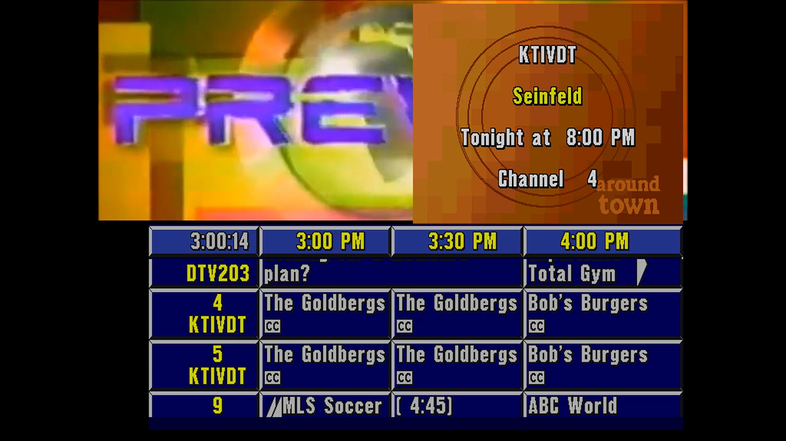

# Orchestrate the Prevue stream

The stream of AmigaSharp is a TV channel with parts that change while it plays. The parts are the video behind the
grid, the top half of the screen, and the layers of the sound. A **coordinator** is a program that changes these
parts on a schedule. For example, a script, Home Assistant, or a cron job. It sends HTTP requests to the port of the
stream.

This document tells what each part does, how fast it changes, and how to use the parts together. The README and
[ctrl-line.md](ctrl-line.md) give all the requests.



## The parts

| Part | What shows or plays | Requests |
|------|---------------------|----------|
| Genlock video | The video behind the grid and in the top half. | `/genlock` (queue) |
| Top half | The genlock video, a promo, or a logo. | `/prevue/ctrl`, `/prevue/logos` |
| Grid | The listings. The coordinator does not control it. | none |
| Video sound | The sound of the current genlock video. | `/mixer/video` |
| Music | A queue of audio files. | `/music` (queue), `/mixer/music` |
| Amiga sound | The sound of Prevue itself. | `/mixer/amiga` |

The top half shows one of three things:

- **Video**: the genlock video. The top half of Prevue is transparent.
- **Promo**: the box of a program: call letters, title, next time, and channel. It covers the right or the left half
  of the top of the screen. The coordinator asks for it.
- **Logo**: a picture that covers all the top of the screen, for example "TV Guide sportsview". ESQ shows the logos
  of `LOGO.LST` in a rotation. The coordinator can show the next logo, or remove it.

## Start the stream

Start the stream with an empty genlock queue, so that the coordinator controls the video:

```sh
./run-prevue.sh --drive /path/to/drive --headless --stream 8091 --genlock-control --audio /path/to/music
```

- `--schedule <file>` plays a schedule in place of `--genlock-control`. A schedule controls the video, the music, and
  the top half, without a coordinator. See [Schedules](#schedules).
- `--audio` fills the music queue and plays it in a loop.
- `--channel-logos` makes a logo for each channel from the logo images of Channels DVR, and `--logos <dir>` from your
  PNG files. See [Make channel logos](ctrl-line.md#make-channel-logos).
- `--restart` starts Prevue again if it stops, for example after a crash. It needs `--headless`. The listings of
  Channels DVR start again too, and the new launcher removes the temporary folders of the old one. The launcher
  also gets `--watchdog 60`: if the picture does not change for a minute, the launcher stops, and the script starts
  it again. The grid of Prevue always moves, and the ESC menu has a clock, so a still picture means a problem.
- The logos come from `LOGO.LST` on the drive. Edit it in the copy of the drive before the stream starts. See
  [Logos](ctrl-line.md#logos).

The HTTP server starts some seconds before Prevue reads its control line. The requests of `/prevue/ctrl` wait in a
queue until then. A coordinator can start at the same time as the stream.

## Timing

A coordinator must know how fast each part changes:

| Action | Time |
|--------|------|
| A file of the genlock queue starts | At once when it is the next item: the launcher prepares it 5 seconds before. |
| A live URL starts | About 3 to 4 seconds. Black shows before it. |
| A command on the control line | 11 bytes each second. A promo is about 2 seconds. |
| Prevue reads a command | Some seconds more, when its display is not busy. |
| The logo rotation of ESQ | About 3 minutes after the last change of the top half. |
| The next logo is ready | ESQ loads it after a logo shows. 20 seconds was enough in tests. |
| A volume change | The `fade` of the request. |

To send control commands in sequence, wait until `lastRequest.read` in `GET /prevue/state` is `true`. See
[Watch the state](#watch-the-state).

## Watch the state

`GET /prevue/state` tells the coordinator what Prevue does now:

```json
{
  "topHalf": "promo-right",
  "line": {"queued": 0, "inEsq": 0, "idle": true, "commands": 2, "checksumErrors": 0},
  "lastRequest": {"name": "promo", "read": true},
  "logos": {
    "loaded": "Enews.uv",
    "nextLine": 3,
    "shown": "tvgsport.uv",
    "list": [{"line": 1, "path": "Logos/tvgsport.uv", "channel": false}]
  }
}
```

- `topHalf` is what the top half shows: `video`, `promo-right`, `promo-left`, `logo`, or `other`. The launcher reads
  it from the picture, so it is always correct. Other screens of Prevue cover the top half too, for example the
  version information when Prevue starts, and the ESC menu of the operator. Then `topHalf` is `logo` or `other`, and
  `logos.shown` does not change. A logo is `logo` when the two halves of the top have content, also when its
  background is the genlock key (color 0), as in the channel logos. `other` is one clear half and one half with only
  some content. To know which logo shows, use `logos.shown`.
- `line` is the state of the control line. `queued` is the bytes in the queue of the launcher, and `inEsq` is the
  bytes that Prevue received and did not read. `idle` is `true` when Prevue read all the commands.
- `lastRequest` is the last request of `/prevue/ctrl`, and `read` is `true` when Prevue read it. For example, after a
  promo request, `read` becomes `true`. Then `topHalf` tells if Prevue found the program: `promo-right` or
  `promo-left` if it found it, and `logo` if not.
- `logos.loaded` is the logo that shows at the next logo command. `logos.nextLine` is the line of `LOGO.LST` that
  Prevue loads after it. `logos.shown` is the last logo that showed.

The launcher knows the variables of Prevue from the listing (`--listing`), or for the known build of ESQ. For another
build of ESQ without a listing, the state has only `topHalf`, the queue of the launcher, and the last request.

## Recipes

### Show a video in the top half

The logo rotation covers the top half about 3 minutes after the last change. To keep the video visible, do one of
these:

- Send `POST /prevue/ctrl/clear` each 30 to 60 seconds while the video plays.
- Or empty `LOGO.LST` in the copy of the drive. Then no logos show, and the promos still work.

### Show a promo

```sh
curl -X POST http://localhost:8091/prevue/ctrl/promo -d '{"title": "Seinfeld", "brush": "AT"}'
```

- Prevue finds the next time of the program in its listings. The promo stays until the next command, or until the
  logo rotation shows a logo.
- If Prevue finds no program, it shows the next logo in place of the promo.
- A promo covers one half of the top of the screen. The genlock video shows in the other half.

### Automatic promos

An automatic promo chooses a program from the listings of Prevue, so the promos stay current without titles in the
schedule:

```sh
curl -X POST http://localhost:8091/prevue/ctrl/promo -d '{"auto": {"movies": true, "within": 3}, "brush": "AT"}'
```

The answer has the program in `picked`. `auto` is `true` for all programs, or an object with these values. Each value
is optional:

| Value | Meaning |
|-------|---------|
| `movies` | `true` for movies only, `false` for no movies. |
| `premium` | `true` for premium channels only, `false` for no premium channels. |
| `channels` | Call letters (with `*` for any text) or channel numbers, for example `["KTIV*", "4"]`. |
| `titles` | Parts of titles, for example `["Seinfeld", "News"]`. Upper case and lower case are the same. |
| `within` | The hours from now for the start of the program. The default is 3. |
| `now` | `true` to also choose a program that plays now. |
| `order` | `soonest` (the default) chooses the next program. `random` chooses by chance. |
| `repeat` | The number of the last automatic promos whose titles do not show again. The default is 10. If all the programs that fit were in these promos, the title of the oldest promo shows again. |

- `brush` sets the background, as for a promo with a title. `side` is `right` (the default) or `left`.
- The launcher reads the listings from the memory of Prevue. Thus Prevue always finds the program that it chooses.
- A movie is a movie in the listings of Channels DVR. The saved listings of the drive have no movies.
- A premium channel is a channel of the `--premium` list of `run-prevue` and of the listings tool
  (`CHANNELS_DVR_PREMIUM` for `run-esq.sh`). A call sign in the list makes all the channel numbers of that call sign
  premium. Without the list, no channel is premium, and `"premium": true` finds no program.
- If no program fits, the answer is an error, and nothing shows.

`GET /prevue/guide` gives the programs that an automatic promo can choose from: the channel, the call letters, the
title, `movie`, `premium`, and `minutes`, the time from the start of the current half hour to the start of the
program. `?hours=5` sets the hours from now (the default is 3), and `?now=true` adds the programs that play now.

### Show a logo

Show a specific logo of `LOGO.LST`:

```sh
curl -X POST http://localhost:8091/prevue/logos/show -d '{"name": "Insider"}'
```

- The name is the path of the line, its file name, or its file name without the extension. `{"line": 3}` chooses a
  line by its number.
- If Prevue loaded another logo, the launcher takes that logo from the memory of Prevue, and Prevue loads Insider.
  The other logo does not show. Then the launcher sends the logo command.
- The logo shows about 5 seconds after the request. The launcher waits until no command came for 5 seconds, so that
  Prevue does not draw the logo that the launcher takes. `logos.pending` in `GET /prevue/state` is the logo until it
  shows.
- If Prevue loaded the logo already, it shows at once.

`POST /prevue/ctrl/logo` shows the loaded logo (`logos.loaded` in `GET /prevue/state`), and Prevue loads the next line
of `LOGO.LST`. `POST /prevue/logos/next` with a name chooses the line that Prevue loads then. Send it before the logo
command. With these two requests, a planned sequence of logos shows at once, without the wait of 5 seconds.

A channel logo (a line without a comma) shows the call letters and the channel number on the picture. See
[Logos](ctrl-line.md#logos) for the format of `LOGO.LST`.

### Music under the videos

- The music becomes quieter while a genlock video with sound plays. `POST /mixer/duck` sets how much quieter.
- `POST /mixer/music` with `volume` and `fade` changes the music slowly, for example louder during a pause.
- `POST /music/queue` adds a song. `{"source": "black", "seconds": 10}` in the music queue is 10 seconds of silence.

### A pause between videos

`{"source": "black", "seconds": 180}` in the genlock queue shows the grid over black for 3 minutes. It has no sound,
so the music plays at its full volume.

## Schedules

A schedule is a JSON file that the launcher plays by itself. It controls the genlock video, the music, and the top
half of the screen, so a simple channel does not need a coordinator. Start the stream with `--schedule <file>`:

```sh
./run-prevue.sh --drive /path/to/drive --headless --stream 8091 --audio /path/to/music --schedule channel.json
```

For example, this schedule plays a video with the top half clear and quiet music. Then it shows 3 minutes over black
with loud music: a promo, a logo, and the top half clear again.

```json
{
  "loop": true,
  "segments": [
    {"video": "prevue-1993.mp4", "music": {"volume": 0.3, "fade": 2}, "top": "clear"},
    {"pause": 180, "music": {"volume": 1, "fade": 3}, "top": [
      {"promo": "Seinfeld", "seconds": 30},
      {"logo": "Insider", "seconds": 30},
      {"clear": true}
    ]}
  ]
}
```

The segments play in order. With `"loop": true`, the first segment follows the last segment. Each segment has these
values:

| Value | Meaning |
|-------|---------|
| `video` | A file or a URL for the genlock. A relative file is relative to the schedule file. |
| `seconds` | Optional, with `video`: the time of the video. Without it, a file plays to its end. |
| `loop` | Optional, with `video`: `true` to play a file in a loop, for example for its `seconds`. |
| `pause` | In place of `video`: the seconds of a pause over black, with no sound. |
| `music` | Optional: the settings of the music when the segment starts: `volume`, `muted` and `fade`. |
| `top` | Optional, for Prevue: the top half of the screen during the segment. |

`top` is one of these:

- `"clear"`: the genlock video shows in the top half during all the segment.
- `"logos"`: the logo rotation of ESQ. The schedule sends no commands.
- A list of cues, in order. Each cue has `seconds`, except the last cue:
  - `{"promo": "Seinfeld", "seconds": 30}`: a promo. The value is a title, or an object as for
    `POST /prevue/ctrl/promo`, for example `{"left": {"title": "Seinfeld"}}` or
    `{"auto": {"movies": true}, "brush": "AT"}`. An automatic promo chooses its program when the cue starts (see
    [Automatic promos](#automatic-promos)). If no program fits, the top half is clear, and the cue tries again each
    2 seconds while its time lasts.
  - `{"logo": "Insider", "seconds": 30}`: a logo of `LOGO.LST`, by its name. `null` shows the loaded logo.
  - `{"clear": true}`: the genlock video in the top half.

About the top half:

- A segment starts when its video starts, and its cues count from that time.
- After a cue with `seconds`, the top half is clear. A clear top half gets a clear command each minute, so the logo
  rotation of ESQ does not start.
- The last cue without `seconds` stays until the end of the segment. A segment without `top` does not change the top
  half.
- The schedule chooses each named logo before the logo before it shows, so each named logo shows at once. When the
  schedule starts, it makes the first named logo the loaded logo. When a named logo is not loaded, it shows about 5
  seconds late (see [Show a logo](#show-a-logo)). No other logo shows.
- Keep each promo and logo cue shorter than 3 minutes. Else the logo rotation of ESQ can replace it.

`GET /schedule` gives the state of the schedule: the current segment, the seconds since its start, and the number of
cycles. The requests of the genlock, the music, the mixer and `/prevue/ctrl` still work while a schedule plays. But
a request that changes the genlock queue can change the order of the segments.

A schedule needs the launcher for Prevue for `top`. The generic launcher plays schedules without `top`.

`--genlock-playlist <file>` is a simpler file for the genlock queue only (see the README). It does not have the music
or the top half.

## Example coordinator

[`scripts/examples/prevue-coordinator.py`](../scripts/examples/prevue-coordinator.py) repeats a cycle:

1. A video plays. The script keeps the top half clear, so the video shows there. The music is quiet.
2. A pause over black. The music is loud. A promo shows for each title, and then a logo.

```sh
python3 scripts/examples/prevue-coordinator.py --url http://localhost:8091 \
    --video /videos/prevue-1993.mp4 --title Seinfeld --title "Bob's Burgers"
```

The script waits until Prevue read each command (`GET /prevue/state`). With `--logo <name>` (more than one), it
shows these logos in turn with `POST /prevue/logos/show`.

The script needs only Python 3. The video path is a path on the computer of the launcher. Use `--help` to see the
options. Change the script to make your own schedule.

## Security

Anyone who can connect to the port of the stream can change the channel. That person can also play any video file
that the launcher can read. Use the stream only on a network that you trust.
